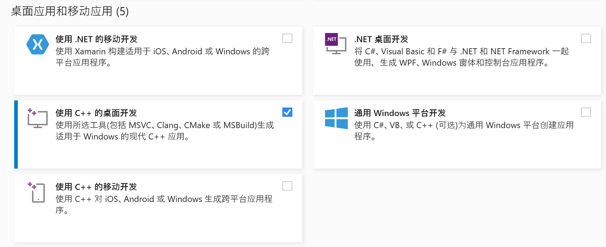
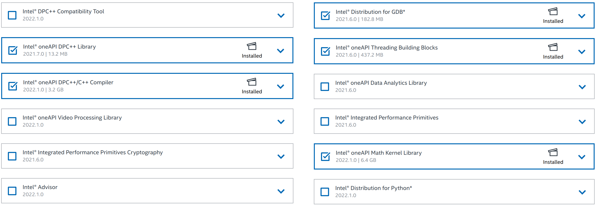

# 开发工具

## 编译器

* Windows 系统（二选一）
  * Visual Studio
  * Mingw-w64-GCC
* Linux 系统（Ubuntu/Debian）
  * GNU GCC

## 依赖库

* C++ 矩阵运算库 armadillo
* 高性能矩阵运算库
    * 使用VS编译器
        * Intel MKL
    * 使用GCC编译器
        * OpenBLAS


## 编译环境搭建

### Windows

* Visual Studio（C++开发套装）
    > Visual Studio 安装选项：


    * Intel oneAPI Base Toolkit
        > Intel oneAPI 安装选项：


    * Reshaper C++插件（建议，可选）


* Mingw-w64-GCC
    * 安装 MSYS2 环境
      * 需要安装的程序及安装命令
        * base-devel
        * mingw-w64-x86_64-toolchain
        * mingw-w64-x86_64-openblas
        * mingw-w64-x86_64-armadillo
        ```shell
        pacman -S base-devel\
            mingw-w64-x86_64-toolchain\
            mingw-w64-x86_64-openblas\
            mingw-w64-x86_64-armadillo
        ```

> * 已测试操作系统 
>   * Windows 10 
>   * Windows 11

### Linux

编译环境为 GNU GCC
* GNU GCC
    * 需要安装的程序及安装命令（Ubuntu/Debian）
        * build-essential
        * libopenblas-dev
        * liblapacke-dev
        * libarpack2-dev
        * libsuperlu-dev
        ```shell
        sudo apt install build-essential\
            libopenblas-dev\
            liblapacke-dev\
            libarpack2-dev\
            libsuperlu-dev
        ```

> * 已测试操作系统 
>   * Ubuntu
>   * Raspbian（树莓派）

### 脚本语言

* Python
* Julia

## 文本编辑器

* Sublime Text 3
* Visual Studio Code

## 版本控制

* git

## 注释生成文档

* doxygen（Windows系统使用需要安装 MSYS2）

## 文档撰写

* Markdown
* pandoc（文档格式转换）
* graphviz（流程图、UML图）
* gnuplot（曲线图绘制）
* GeoGebra（几何图形绘制）
* LaTeX 或 TeXmacs（公式较多的理论文档）


# 编译过程

1. 启动命令行窗口，建立开发文件夹，例如

    ```shell
    mkdir  ~/Develop
    ```

2. 下载 armadillo 源代码，解压至开发文件夹（MSYS2 不需要）

3. 用 git 获取 RODS 最新代码

    ```shell
    git clone https://gitee.com/rods/rods.git
    ```

4. 编译
* 若使用 Visual Studio：打开RODS.sln，点击生成解决方案即可。

* 若使用 GCC
    * MSYS2

    ```shell
    cd rods/RODS && make -j n
    # 说明：n为并行编译的进程数
    ```

    * Ubuntu/Debian

    ```shell
    cd rods/RODS && make -j n -f makefile_ubuntu
    # 说明：n为并行编译的进程数
    ```

5. 生成帮助文档（MSYS2 或 Linux）

    ```shell
    doxygen
    ```