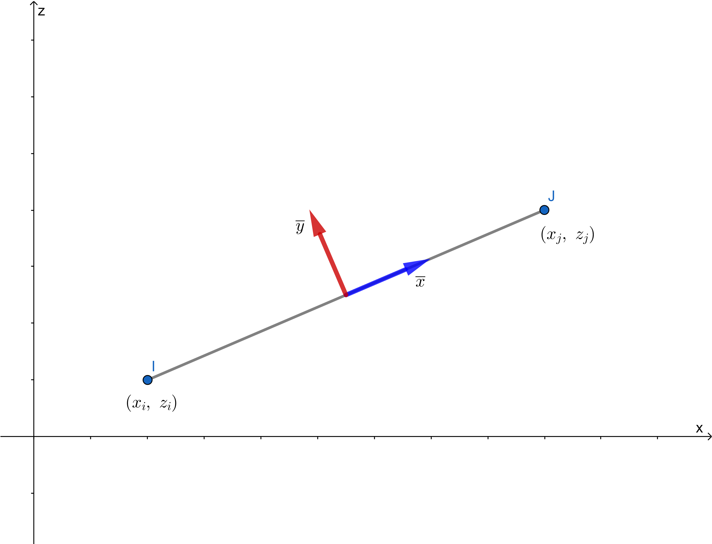
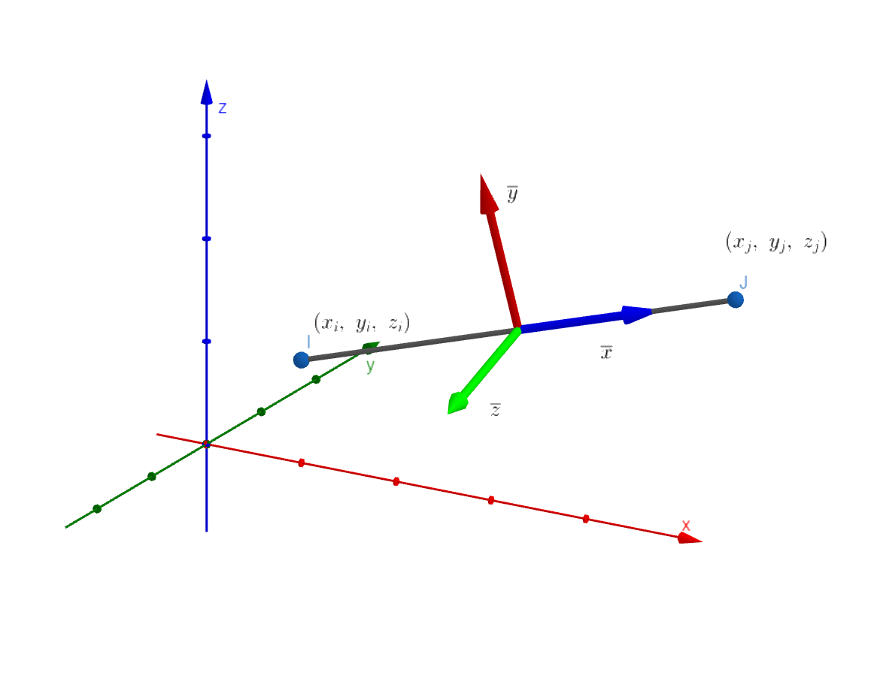

# 杆系单元的局部坐标系及坐标变换

[TOC]

## 二维

### 公式

* 整体坐标轴的单位向量
$$
\begin{aligned}
    \mathbf{i} &= (1,0)^T\\
    \mathbf{j} &= (0,1)^T
\end{aligned}
$$

* 局部坐标轴的单位向量
$$
\begin{aligned}
    \mathbf{\overline{i}} &= \left( \frac{\Delta x}{L}, \frac{\Delta z}{L} \right)^T\\
    \mathbf{\overline{j}} &= \left( -\frac{\Delta z}{L}, \frac{\Delta x}{L} \right)^T
\end{aligned}
$$
其中
$$
\begin{aligned}
L &= \sqrt{\Delta x^2 + \Delta y^2} 
\end{aligned}
$$

* 坐标转换矩阵
$$ \mathbf{\lambda} = \frac{1}{L} \left[ \begin{aligned}
\Delta x \quad & \Delta z \\
-\Delta z \quad & \Delta x
\end{aligned} \right]
$$

### 推导过程

* X-Z 平面
* 两个节点为 $I(x_i, z_i)$ 和 $J(x_j, z_j)$
* 定义
$$ \Delta x = x_j - x_i \quad \Delta z = z_j - z_i $$
* 单元长度为\
$$L = \sqrt{\Delta x^2 + \Delta z^2}$$
* 以向量 $ \vec{IJ} $ 为局部 X 轴，则局部 X 轴的单位向量为
$$ \mathbf {\overline i} = \left( \frac{\Delta x}{L}, \frac{\Delta z}{L} \right)^T $$
* 局部 Y 轴与 X 轴垂直，其单位向量为
$$ \mathbf {\overline j} = \left( -\frac{\Delta z}{L}, \frac{\Delta x}{L} \right)^T$$

* 整体坐标轴的单位向量
$$ 
\begin{aligned}
\mathbf {i} = \left( 1, 0 \right)^T \\
\mathbf {j} = \left( 0, 1 \right)^T 
\end{aligned}
$$

* 局部坐标轴的方向余弦

$$ 
\begin{aligned}
\cos \left< \mathbf {\overline i}, \mathbf {i} \right> &= \mathbf {\overline i} \cdot \mathbf {i} = \frac{\Delta x}{L} \\
\cos \left< \mathbf {\overline i}, \mathbf {j} \right> &= \mathbf {\overline i} \cdot \mathbf {j} = \frac{\Delta z}{L} \\
\cos \left< \mathbf {\overline j}, \mathbf {i} \right> &= \mathbf {\overline j} \cdot \mathbf {i} = -\frac{\Delta z}{L} \\
\cos \left< \mathbf {\overline j}, \mathbf {j} \right> &= \mathbf {\overline j} \cdot \mathbf {j} = \frac{\Delta x}{L}
\end{aligned}
$$

* 坐标转换矩阵
$$ \mathbf{\lambda} = \left[ \begin{aligned}
\cos \left< \mathbf {\overline i}, \mathbf {i} \right> \quad & \cos \left< \mathbf {\overline i}, \mathbf {j} \right> \\
\cos \left< \mathbf {\overline j}, \mathbf {i} \right> \quad & \cos \left< \mathbf {\overline j}, \mathbf {j} \right>
\end{aligned} \right]
= \frac{1}{L} \left[ \begin{aligned}
\Delta x \quad & \Delta z \\
-\Delta z \quad & \Delta x
\end{aligned} \right]
$$

## 三维

* 右手坐标系

### 公式

* 整体坐标轴的单位向量
$$
\begin{aligned}
    \mathbf{i} &= (1,0,0)^T\\
    \mathbf{j} &= (0,1,0)^T\\
    \mathbf{k} &= (0,0,1)^T
\end{aligned}
$$

* 局部坐标轴的单位向量
$$
\begin{aligned}
    \mathbf{\overline{i}} &= \frac{1}{L} \left( \Delta x, \Delta y, \Delta z \right)^T\\
    \mathbf{\overline{j}} &= \frac{1}{L \cdot l}
    \left (
    -\Delta x \Delta z, \Delta y \Delta z, l^2
    \right )^T\\
    \mathbf{\overline{k}} &= \frac{1}{l}
    \left (\Delta y, -\Delta x, 0\right )^T
\end{aligned}
$$
其中
$$
\begin{aligned}
L &= \sqrt{\Delta x^2 + \Delta y^2 + \Delta z^2} \\
l &= \sqrt{\Delta x^2 + \Delta y^2} 
\end{aligned}
$$

* 坐标转换矩阵
$$ \mathbf{\lambda} = \frac{1}{L \cdot l} \left[ \begin{aligned}
 l\Delta x \quad & l\Delta y \quad & l\Delta z \\
-\Delta x \Delta z \quad & \Delta y \Delta z \quad & l^2 \\
L\Delta y \quad & -L\Delta x \quad & 0 \\
\end{aligned} \right]
$$

* 当 $\Delta x = \Delta y = 0$ 时
  * 若 $\Delta z > 0$
$$
\begin{aligned}
\mathbf{\overline i} = 
\left (
0, 0, 1
\right )^T\\
\mathbf{\overline j} = 
\left (
1, 0, 0
\right )^T\\
\mathbf{\overline k} = 
\left (
0, 1, 0
\right )^T
\end{aligned}
$$
  * 若 $\Delta z < 0$
$$
\begin{aligned}
\mathbf{\overline i} = 
\left (
0, 0, -1
\right )^T\\
\mathbf{\overline j} = 
\left (
-1, 0, 0
\right )^T\\
\mathbf{\overline k} = 
\left (
0, 1, 0
\right )^T
\end{aligned}
$$

### 推导过程

* 两个节点为 $I(x_i, y_i, z_i)$ 和 $J(x_j, y_j, z_j)$
* 定义
$$ \begin{aligned}
\Delta x &= x_j - x_i \\
\Delta y &= y_j - y_i \\
\Delta z &= z_j - z_i \\
\end{aligned} 
 $$
* 单元长度为\
$$ L = \sqrt{\Delta x^2 + \Delta y^2 + \Delta z^2} $$

* 整体坐标轴的单位向量
$$ 
\begin{aligned}
\mathbf {i} = \left( 1, 0, 0 \right)^T \\
\mathbf {j} = \left( 0, 1, 0 \right)^T \\
\mathbf {k} = \left( 0, 0, 1 \right)^T \\
\end{aligned}
$$

* 局部 X 轴的单位向量
$$ \mathbf {\overline i} = 
\left( 
    \frac{\Delta x}{L},
    \frac{\Delta y}{L},
    \frac{\Delta z}{L}
\right)^T $$
* 取整体 Z 轴与局部 X 轴形成局部 X-Y 平面，则局部 Z 轴向量可通过叉乘得到
$$
\mathbf{\hat k} = \mathbf{\overline{i}} \times \mathbf{k} = 
\left |
\begin{matrix}
\mathbf{i} & \mathbf{j} & \mathbf{k}\\
\frac{\Delta x}{L} & \frac{\Delta y}{L} & \frac{\Delta z}{L} \\
0 & 0 & 1
\end{matrix}
\right |
$$
    即
$$
\mathbf{\hat k} = \frac{1}{L}
\left (
\Delta y, -\Delta x, 0
\right )^T
$$
    则
$$
\mathbf{\overline k} = 
\frac{1}{\sqrt{\Delta x^2 + \Delta y^2}}
\left (
\Delta y, -\Delta x, 0
\right )^T
 = \frac{1}{l}
\left (
\Delta y, -\Delta x, 0
\right )^T
$$

* 局部 Y 轴可由局部 Z 轴和局部 X 轴叉乘得到
$$
\mathbf{\overline j} = \mathbf{\overline k} \times \mathbf{\overline i} = 
\left |
\begin{matrix}
\mathbf{i} & \mathbf{j} & \mathbf{k}\\
\frac{\Delta y}{l} & -\frac{\Delta x}{l} & 0 \\
\frac{\Delta x}{L} & \frac{\Delta y}{L} & \frac{\Delta z}{L}
\end{matrix}
\right |
$$
    即
$$
\mathbf{\overline j} = \frac{1}{L \cdot l}
\left (
-\Delta x \Delta z, \Delta y \Delta z, l^2
\right )^T
$$

* 当 $\Delta x = \Delta y = 0$ 时，局部 X 轴和整体 Z 轴共线，此时取整体 Y 轴为局部 Z 轴
$$
\mathbf{\overline k} = 
\left (
0, 1, 0
\right )^T
$$
    则局部 Y 轴的单位向量可由局部 Z 轴和局部 X 轴叉乘得到
$$
\begin{aligned}
\mathbf{\overline j} &= \mathbf{\overline k} \times \mathbf{\overline i} = 
\left |
\begin{matrix}
\mathbf{i} & \mathbf{j} & \mathbf{k}\\
0 & 1 & 0 \\
0 & 0 & 1
\end{matrix}
\right |  \\
 &= \left (
1, 0, 0
\right )^T
\end{aligned}
$$
或
$$
\begin{aligned}
\mathbf{\overline j} &= \mathbf{\overline k} \times \mathbf{\overline i} = 
\left |
\begin{matrix}
\mathbf{i} & \mathbf{j} & \mathbf{k}\\
0 & 1 & 0 \\
0 & 0 & -1
\end{matrix}
\right |  \\
 &= \left (
-1, 0, 0
\right )^T
\end{aligned}
$$