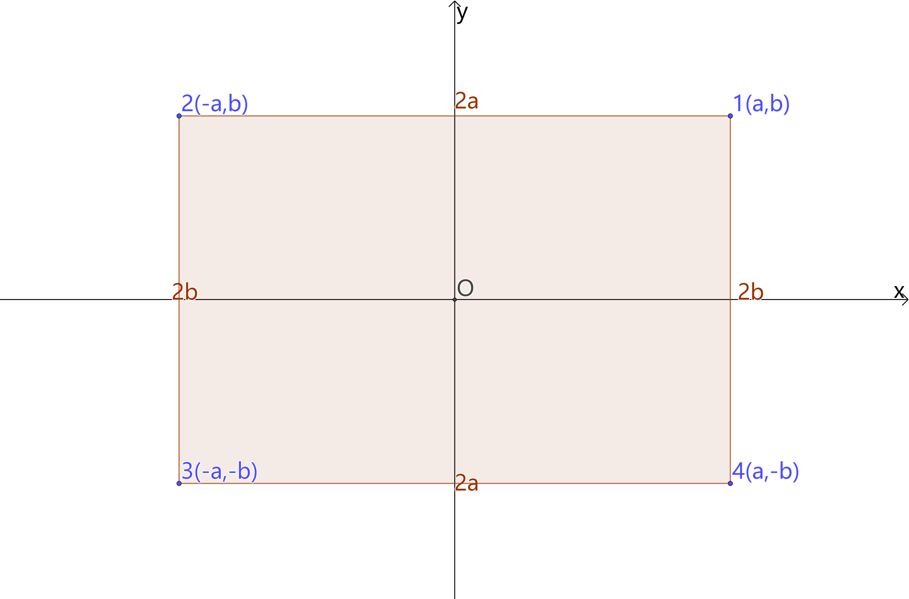
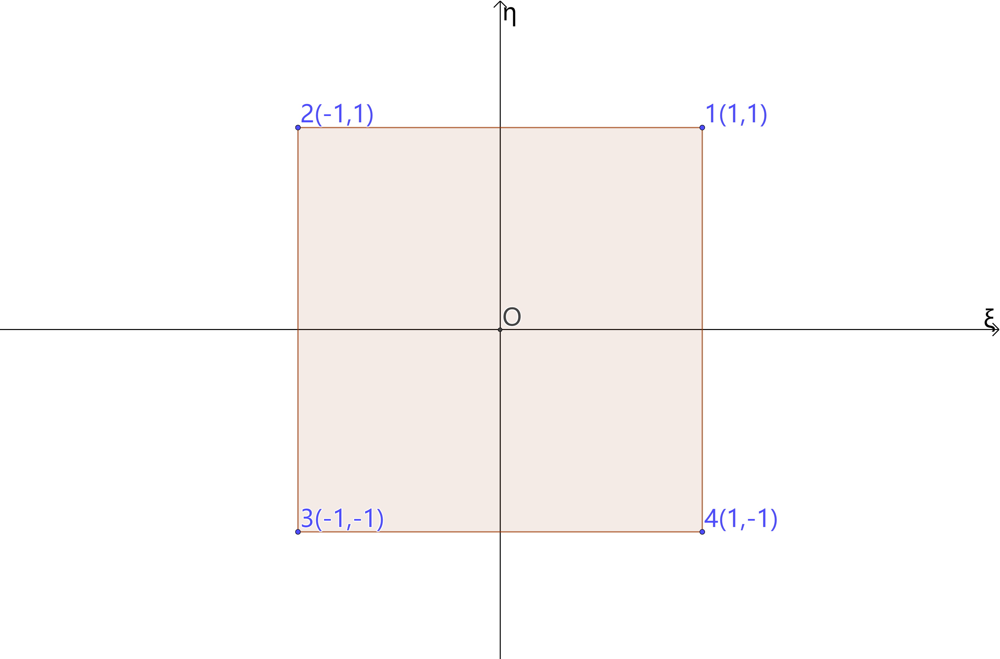

# 弹性壳单元
## 矩形壳

由矩形平面应力单元和矩形板单元组合而成。

### 局部坐标系

四个节点，记为1、2、3、4，局部坐标依次记为$\left(x_1, y_1\right)$、$\left(x_2, y_2\right)$、$\left(x_3, y_3\right)$、$\left(x_4, y_4\right)$。每个节点有两个局部自由度

$$
\begin{aligned}
u_i & \quad \cdots & i=1,2,3,4\\
v_i & \quad \cdots & i=1,2,3,4
\end{aligned}
$$

中心点坐标$\left(x_0, y_0\right)$

$$
\begin{aligned}
x_0 &= \frac{1}{4} \left(x_1 + x_2 + x_3 + x_4\right)\\
y_0 &= \frac{1}{4} \left(y_1 + y_2 + y_3 + y_4\right)
\end{aligned}
$$

矩形的两个边长

$$
\begin{aligned}
2a &= \sqrt{\left(x_2 - x_1\right)^2 + \left(y_2 - y_1\right)^2} \\
2b &= \sqrt{\left(x_4 - x_1\right)^2 + \left(y_4 - y_1\right)^2}
\end{aligned}
$$

以中心点为坐标原点，并将坐标归一化处理

$$
\begin{aligned}
\xi &= \frac{x}{a} \\
\eta &= \frac{y}{b}
\end{aligned}
$$

四个节点的归一化坐标

| 节点 $i$ |  归一化坐标 $(\xi_i, \eta_i)$ |
|---|---|
| 1  | (1, 1)  |
| 2  | (-1, 1) |
| 3  | (-1, -1)|
| 4  | (1, -1) |

### 矩形平面应力单元

形函数

$$
N_i \left(\xi, \eta \right) = \frac{1}{4}\left(1 + \xi_i\xi \right)\left(1 + \eta_i\eta \right) \quad \cdots \quad i = 1,2,3,4
$$

几何矩阵

$$
\boldsymbol{B} = \begin{pmatrix}
\boldsymbol{B}_1 & \boldsymbol{B}_2 & \boldsymbol{B}_3 & \boldsymbol{B}_4
\end{pmatrix}
$$

$$
\boldsymbol{B}_i = \begin{pmatrix}
\dfrac{\partial N_i}{\partial x} & 0\\
0 & \dfrac{\partial N_i}{\partial y}\\
\dfrac{\partial N_i}{\partial y} & \dfrac{\partial N_i}{\partial x}
\end{pmatrix} = \begin{pmatrix}
\dfrac{\partial N_i}{a \partial \xi} & 0\\
0 & \dfrac{\partial N_i}{b \partial \eta}\\
\dfrac{\partial N_i}{b \partial \eta} & \dfrac{\partial N_i}{a \partial \xi}
\end{pmatrix}=\frac{1}{4ab}\begin{pmatrix}b {{\xi }_i} \left( {{\eta }_i} \eta +1\right)  & 0\\
0 & a {{\eta }_i} \left( {{\xi }_i} \xi +1\right) \\
b {{\eta }_i} \left( {{\xi }_i} \xi +1\right)  & a {{\xi }_i} \left( {{\eta }_i} \eta +1\right) \end{pmatrix}
$$

本构矩阵

$$
\boldsymbol{D} = \frac{E}{1-\nu^2}\begin{pmatrix}
1 & \nu & 0\\
\nu & 1 & 0\\
0 & 0 & \frac{1-\nu}{2}
\end{pmatrix} 
$$

刚度矩阵

$$
\boldsymbol{k}^p = ab \int_{-1}^1 \int_{-1}^1 {\boldsymbol{B}^T \boldsymbol{D} \boldsymbol{B} t \mathrm{d}\xi \mathrm{d}\eta}
$$

分块刚度矩阵

$$
\boldsymbol{k}^p_{ij} = ab \int_{-1}^1 \int_{-1}^1 {\boldsymbol{B}^T_i \boldsymbol{D} \boldsymbol{B}_j t \mathrm{d}\xi \mathrm{d}\eta} \quad \cdots \quad i,j=1,2,3,4
$$

$$
\boldsymbol{k}_{ij}^{p}=\frac{Et}{4\left( 1-\nu ^2 \right)}\left( \begin{matrix}
	\frac{1-\nu}{2}\frac{a}{3b}\eta _i\eta _j\left( \xi _i\xi _j+3 \right) +\frac{b}{3a}\left( \eta _i\eta _j+3 \right) \xi _i\xi _j&		\xi _i\eta _j\nu +\frac{1-\nu}{2}\eta _i\xi _j\\
	\eta _i\xi _j\nu +\frac{1-\nu}{2}\xi _i\eta _j&		\frac{1-\nu}{2}\frac{b}{3a}\left( \eta _i\eta _j+3 \right) \xi _i\xi _j+\frac{a}{3b}\left( \xi _i\xi _j+3 \right) \eta _i\eta _j\\
\end{matrix} \right) 
$$

### 矩形板单元

节点局部自由度

$$
\begin{aligned}
w_i & \quad \cdots & i=1,2,3,4\\
\theta_{xi} & \quad \cdots & i=1,2,3,4\\
\theta_{yi} & \quad \cdots & i=1,2,3,4
\end{aligned}
$$

形函数

$$
\begin{aligned}
N_i & = \frac{\left( {{\eta }_i} \eta +1\right) \, \left( {{\xi }_i} \xi +1\right) \, \left( -{{\xi }^{2}}+{{\xi }_i} \xi -{{\eta }^{2}}+{{\eta }_i} \eta +2\right) }{8} & \quad \cdots \quad & i=1,2,3,4\\
N_{xi} & = -\frac{b {{\eta }_i} \left( {{\eta }_i} \eta +1\right) \, \left( 1-{{\eta }^{2}}\right) \, \left( {{\xi }_i} \xi +1\right) }{8} & \quad \cdots \quad & i=1,2,3,4\\
N_{yi} & = \frac{a {{\xi }_i} \left( {{\eta }_i} \eta +1\right) \, \left( {{\xi }_i} \xi +1\right) \, \left( 1-{{\xi }^{2}}\right) }{8} & \quad \cdots \quad & i=1,2,3,4
\end{aligned}
$$

几何矩阵

$$
{{\boldsymbol{B}}_i} = \begin{pmatrix}
{ - \frac{{{\partial ^2}{N_i}}}{{{a^2}\partial {\xi ^2}}}}
&{ - \frac{{{\partial ^2}{N_{xi}}}}{{{a^2}\partial {\xi ^2}}}}&{ - \frac{{{\partial ^2}{N_{yi}}}}{{{a^2}\partial {\xi ^2}}}}\\
{ - \frac{{{\partial ^2}{N_i}}}{{{b^2}\partial {\eta ^2}}}}&{ - \frac{{{\partial ^2}{N_{xi}}}}{{{b^2}\partial {\eta ^2}}}}&{ - \frac{{{\partial ^2}{N_{yi}}}}{{{b^2}\partial {\eta ^2}}}}\\
{ - \frac{{2{\partial ^2}{N_i}}}{{ab\partial \eta \partial \xi }}}&{ - \frac{{2{\partial ^2}{N_{xi}}}}{{ab\partial \eta \partial \xi }}}&{ - \frac{{2{\partial ^2}{N_{yi}}}}{{ab\partial \eta \partial \xi }}}
\end{pmatrix}
$$

$$
=\begin{pmatrix}\frac{\left( 3 {{\eta }_i} {{\xi }_i} \eta +3 {{\xi }_i}\right)  \xi }{4 {{a}^{2}}} & 0 & \frac{\left( 3 {{\eta }_i} \eta +3\right)  \xi +{{\eta }_i} {{\xi }_i} \eta +{{\xi }_i}}{4 a}\\
\frac{3 {{\eta }_i} {{\xi }_i} \eta  \xi +3 {{\eta }_i} \eta }{4 {{b}^{2}}} & -\frac{\left( 3 {{\xi }_i} \eta +{{\eta }_i} {{\xi }_i}\right)  \xi +3 \eta +{{\eta }_i}}{4 b} & 0\\
\frac{3 {{\eta }_i} {{\xi }_i} {{\xi }^{2}}+3 {{\eta }_i} {{\xi }_i} {{\eta }^{2}}-4 {{\eta }_i} {{\xi }_i}}{4 a b} & -\frac{3 {{\xi }_i} {{\eta }^{2}}+2 {{\eta }_i} {{\xi }_i} \eta -{{\xi }_i}}{4 a} & \frac{3 {{\eta }_i} {{\xi }^{2}}+2 {{\eta }_i} {{\xi }_i} \xi -{{\eta }_i}}{4 b}\end{pmatrix}
$$

本构矩阵

$$
\boldsymbol{D} = \frac{E t^3}{12\left(1-\nu^2\right)}\begin{pmatrix}
1 & \nu & 0\\
\nu & 1 & 0\\
0 & 0 & 1-\frac{\nu}{2}
\end{pmatrix} 
$$

分块刚度矩阵

$$
\boldsymbol{k}^b_{ij} = ab \int_{-1}^1 \int_{-1}^1 {\boldsymbol{B}^T_i \boldsymbol{D} \boldsymbol{B}_j \mathrm{d}\xi \mathrm{d}\eta} = \frac{E t^3}{720 a b\left(1-\nu^2\right)}\boldsymbol{a}_{3 \times 3}
$$

$$
\begin{aligned}
a_{11} & = \frac{{15{b^2}}}{{{a^2}}}{\xi _i}{\xi _j}\left( {{\eta _i}{\eta _j} + 3} \right) + \frac{{15{a^2}}}{{{b^2}}}{\eta _i}{\eta _j}\left( {{\xi _i}{\xi _j} + 3} \right) + 6\left( {7 - 2\nu } \right){\xi _i}{\xi _j}{\eta _i}{\eta _j}\\
a_{12} & = - 3b{\xi _i}{\xi _j}\left( {5{\eta _j}\nu  + 3{\eta _i}\nu  + 2{\eta _i} + \frac{{5{a^2}{\eta _i}}}{{{b^2}}}} \right) - \frac{{45{a^2}{\eta _i}}}{b}\\
a_{13} & = 3a{\eta _i}{\eta _j}\left( {5{\xi _j}\nu  + 3{\xi _i}\nu  + 2{\xi _i} + \frac{{5{b^2}{\xi _i}}}{{{a^2}}}} \right) + \frac{{45{b^2}{\xi _i}}}{a}\\
a_{21} & = - 3b{\xi _i}{\xi _j}\left( {5{\eta _i}\nu  + 3{\eta _j}\nu  + 2{\eta _j} + \frac{{5{a^2}{\eta _j}}}{{{b^2}}}} \right) - \frac{{45{a^2}{\eta _j}}}{b}\\
a_{22} & = \left[ {{a^2} + 2{b^2}\left( {1 - \nu } \right)} \right]{\xi _i}{\xi _j}\left( {5{\eta _i}{\eta _j} + 3} \right) + 3{a^2}\left( {4{\xi _i}{\xi _j} + 5{\eta _i}{\eta _j} + 15} \right)\\
a_{23} & = -15 a b\, \left( {{\eta }_j}+{{\eta }_i}\right) \, \left( {{\xi }_j}+{{\xi }_i}\right)  \nu \\
a_{31} & = 3a{\eta _i}{\eta _j}\left( {5{\xi _i}\nu  + 3{\xi _j}\nu  + 2{\xi _j} + \frac{{5{b^2}{\xi _j}}}{{{a^2}}}} \right) + \frac{{45{b^2}{\xi _j}}}{a}\\
a_{32} & = -15 a b\, \left( {{\eta }_j}+{{\eta }_i}\right) \, \left( {{\xi }_j}+{{\xi }_i}\right)  \nu \\
a_{33} & = \left[ {{b^2} + 2{a^2}\left( {1 - \nu } \right)} \right]{\eta _i}{\eta _j}\left( {5{\xi _i}{\xi _j} + 3} \right) + 3{b^2}\left( {4{\eta _i}{\eta _j} + 5{\xi _i}{\xi _j} + 15} \right)\\
\end{aligned}
$$

### 矩形壳单元

矩形的两个边长

$$
\begin{aligned}
2a &= \sqrt{\left(x_2 - x_1\right)^2 + \left(y_2 - y_1\right)^2  + \left(z_2 - z_1\right)^2} \\
2b &= \sqrt{\left(x_4 - x_1\right)^2 + \left(y_4 - y_1\right)^2  + \left(z_4 - z_1\right)^2}
\end{aligned}
$$

局部$x,y$轴单位向量

$$
\begin{aligned}
    \boldsymbol{\overline{i}} = \frac{1}{2a}(x_1 - x_2, y_1 - y_2, z_1 - z_2)^T\\
    \boldsymbol{\overline{j}} = \frac{1}{2b}(x_1 - x_4, y_1 - y_4, z_1 - z_4)^T\\
\end{aligned}
$$

局部$z$轴单位向量

$$
\boldsymbol{\overline{k}} = \boldsymbol{\overline{i}} \times \boldsymbol{\overline{j}} = \begin{vmatrix}
    \boldsymbol{i} & \boldsymbol{j} & \boldsymbol{k}\\
    \frac{x_1 - x_2}{2a} & \frac{y_1 - y_2}{2a} & \frac{z_1 - z_2}{2a}\\
    \frac{x_1 - x_4}{2b} & \frac{y_1 - y_4}{2b} & \frac{z_1 - z_4}{2b}\\
\end{vmatrix} = \frac{1}{4ab} \begin{pmatrix}
	\left( y_1-y_2 \right) \left( z_1-z_4 \right) -\left( z_1-z_2 \right) \left( y_1-y_4 \right)\\
	\left( z_1-z_2 \right) \left( x_1-x_4 \right) -\left( x_1-x_2 \right) \left( z_1-z_4 \right)\\
	\left( x_1-x_2 \right) \left( y_1-y_4 \right) -\left( y_1-y_2 \right) \left( x_1-x_4 \right)\\
\end{pmatrix}
$$

整体坐标轴的单位向量
$$
\begin{aligned}
    \mathbf{i} &= (1,0,0)^T\\
    \mathbf{j} &= (0,1,0)^T\\
    \mathbf{k} &= (0,0,1)^T
\end{aligned}
$$

节点局部自由度

$$
\begin{aligned}
u_i & \quad \cdots & i=1,2,3,4\\
v_i & \quad \cdots & i=1,2,3,4\\
w_i & \quad \cdots & i=1,2,3,4\\
\theta_{xi} & \quad \cdots & i=1,2,3,4\\
\theta_{yi} & \quad \cdots & i=1,2,3,4\\
\theta_{zi} & \quad \cdots & i=1,2,3,4
\end{aligned}
$$

分块刚度矩阵

$$
\boldsymbol{k}^e_{ij} = \begin{pmatrix}
    \boldsymbol{k}^p_{ij} & \boldsymbol{0}_{2 \times 4} & \boldsymbol{0}_{2 \times 1}\\
    \boldsymbol{0}_{4 \times 2} & \boldsymbol{k}^b_{ij} & \boldsymbol{0}_{4 \times 1}\\
    \boldsymbol{0}_{1 \times 2} & \boldsymbol{0}_{1 \times 4} & k_{\theta z}
\end{pmatrix}\quad \cdots \quad i,j=1,2,3,4
$$

坐标转换矩阵

$$
\boldsymbol{T} = \begin{pmatrix}
    \boldsymbol{\lambda} & \boldsymbol{0} & \boldsymbol{0} & \boldsymbol{0} \\
    \boldsymbol{0} & \boldsymbol{\lambda} & \boldsymbol{0} & \boldsymbol{0} \\
    \boldsymbol{0} & \boldsymbol{0} & \boldsymbol{\lambda} & \boldsymbol{0} \\
    \boldsymbol{0} & \boldsymbol{0} & \boldsymbol{0} & \boldsymbol{\lambda} \\
\end{pmatrix}
$$

$$
\boldsymbol{\lambda} = \begin{pmatrix}
    l_{x \hat{x}} & l_{x \hat{y}} & l_{x \hat{z}} & 0 & 0 & 0\\
    l_{y \hat{x}} & l_{y \hat{y}} & l_{y \hat{z}} & 0 & 0 & 0\\
    l_{z \hat{x}} & l_{z \hat{y}} & l_{z \hat{z}} & 0 & 0 & 0\\
    0 & 0 & 0 & l_{x \hat{x}} & l_{x \hat{y}} & l_{x \hat{z}}\\
    0 & 0 & 0 & l_{y \hat{x}} & l_{y \hat{y}} & l_{y \hat{z}}\\
    0 & 0 & 0 & l_{z \hat{x}} & l_{z \hat{y}} & l_{z \hat{z}}\\
\end{pmatrix}
$$

其中，

$$
\begin{aligned}
    l_{x \hat{x}} &= \frac{x_1 - x_2}{2a} & l_{x \hat{y}} &= \frac{x_1 - x_4}{2b} & l_{x \hat{z}} &= \frac{\left( y_1-y_2 \right) \left( z_1-z_4 \right) -\left( z_1-z_2 \right) \left( y_1-y_4 \right) }{4ab}\\
    l_{y \hat{x}} &= \frac{y_1 - y_2}{2a} & l_{y \hat{y}} &= \frac{y_1 - y_4}{2b} & l_{y \hat{z}} &= \frac{\left( z_1-z_2 \right) \left( x_1-x_4 \right) -\left( x_1-x_2 \right) \left( z_1-z_4 \right)}{4ab}\\
    l_{z \hat{x}} &= \frac{z_1 - z_2}{2a} & l_{z \hat{y}} &= \frac{z_1 - z_4}{2b} & l_{z \hat{z}} &= \frac{\left( x_1-x_2 \right) \left( y_1-y_4 \right) -\left( y_1-y_2 \right) \left( x_1-x_4 \right)}{4ab}\\
\end{aligned}
$$

## 三角形壳

### 三角形平面应变单元

面积

$$
A = \frac{1}{2} \begin{vmatrix}
    x_i & y_i & 1\\
    x_j & y_j & 1\\
    x_k & y_k & 1\\
\end{vmatrix}
$$

形函数

$$
N_i = \frac{1}{2A}\left( a_i + b_i x + c_i y\right)
$$

$$
\begin{aligned}
    a_i & = x_j y_k - x_k y_j\\
    b_i & = y_j - y_k\\
    c_i & = x_k - x_j\\
\end{aligned}
$$

下标按 $i \to j \to k \to i$ 顺序轮换。

几何矩阵

$$
\boldsymbol{B_i} = \frac{1}{2A} \begin{pmatrix}
    b_i & 0\\
    0 & c_i\\
    c_i & b_i\\
\end{pmatrix}
$$

本构矩阵

$$
\boldsymbol{D} = \frac{E}{1-\nu^2}\begin{pmatrix}
1 & \nu & 0\\
\nu & 1 & 0\\
0 & 0 & \frac{1-\nu}{2}
\end{pmatrix} 
$$

刚度矩阵

$$
\boldsymbol{k}^p = \int_A {\boldsymbol{B}^T \boldsymbol{D} \boldsymbol{B} t \mathrm{d}A} = A t \boldsymbol{B}^T \boldsymbol{D} \boldsymbol{B}
$$

$$
\boldsymbol{k}^p = \begin{pmatrix}
    \boldsymbol{k}^p_{ii} & \boldsymbol{k}^p_{ij} & \boldsymbol{k}^p_{ik} \\
    \boldsymbol{k}^p_{ji} & \boldsymbol{k}^p_{jj} & \boldsymbol{k}^p_{jk} \\
    \boldsymbol{k}^p_{ki} & \boldsymbol{k}^p_{kj} & \boldsymbol{k}^p_{kk} \\
\end{pmatrix}
$$

$$
\boldsymbol{k}^p_{ij} = \frac{Et}{4 (1-\nu^2) A}\begin{pmatrix}
	\frac{1-\nu}{2}\cdot c_ic_j+b_ib_j&		b_ic_j\nu +\frac{1-\nu}{2}\cdot c_ib_j\\
	c_ib_j\nu +\frac{1-\nu}{2}\cdot b_ic_j&		\frac{1-\nu}{2}\cdot b_ib_j+c_ic_j\\
\end{pmatrix}
$$

### 三角形板单元

