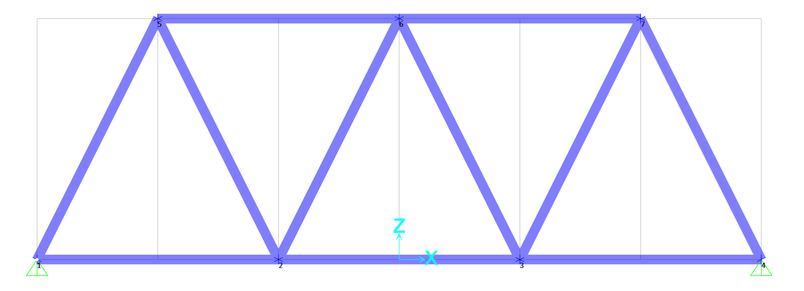
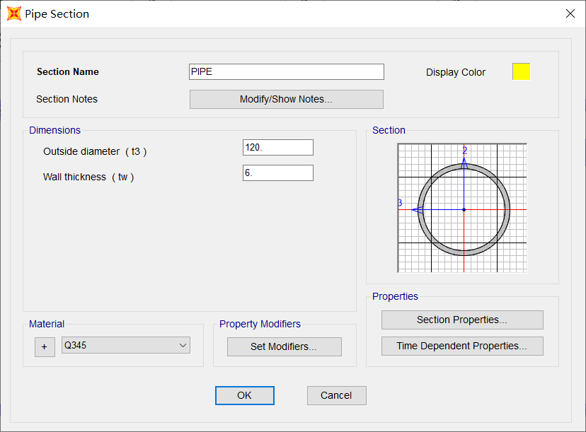
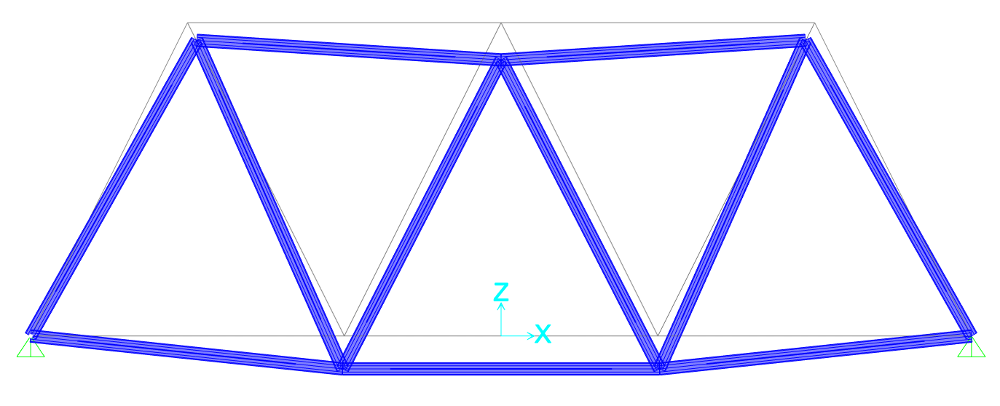
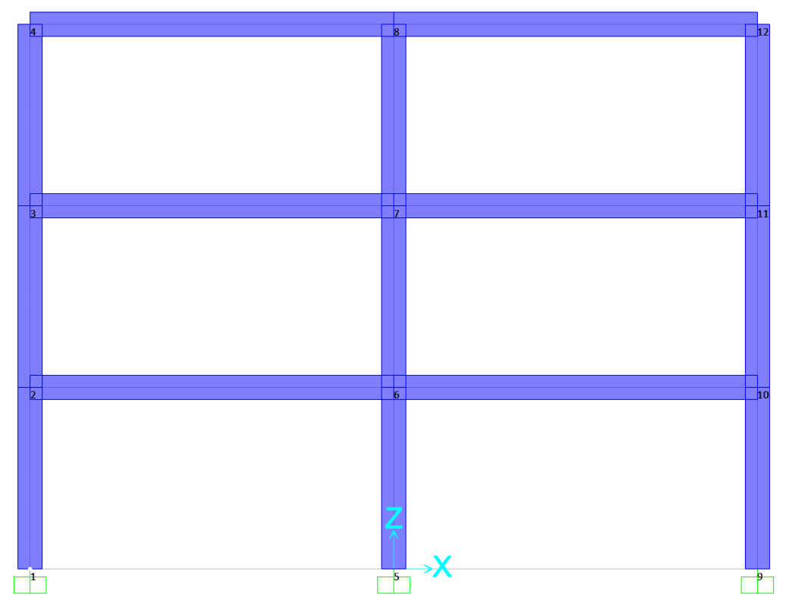
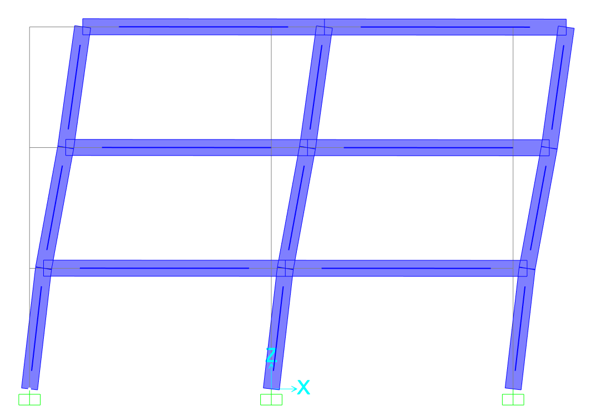
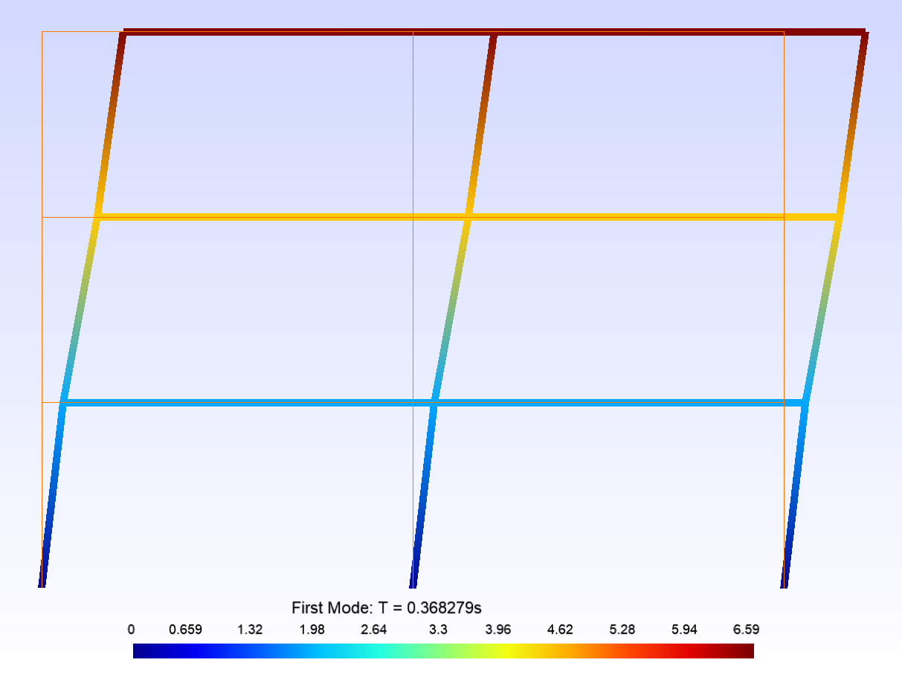
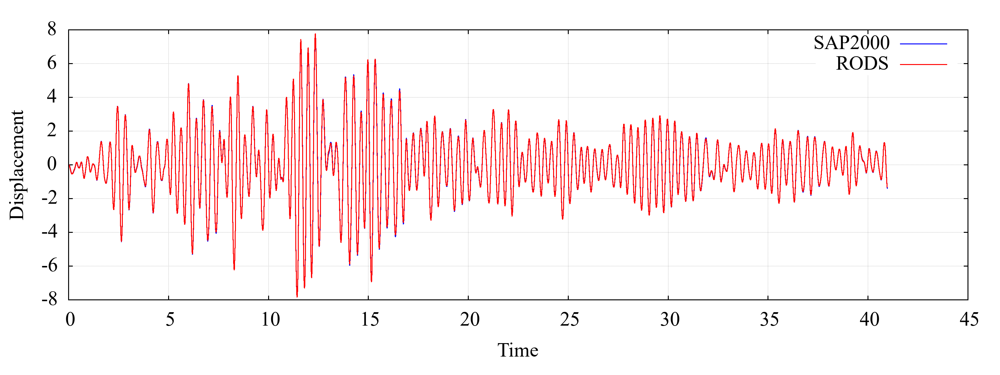
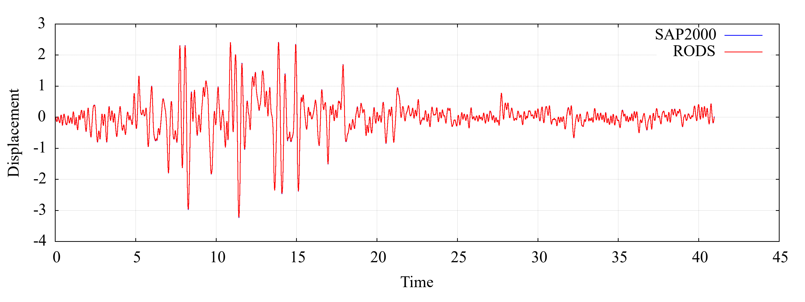
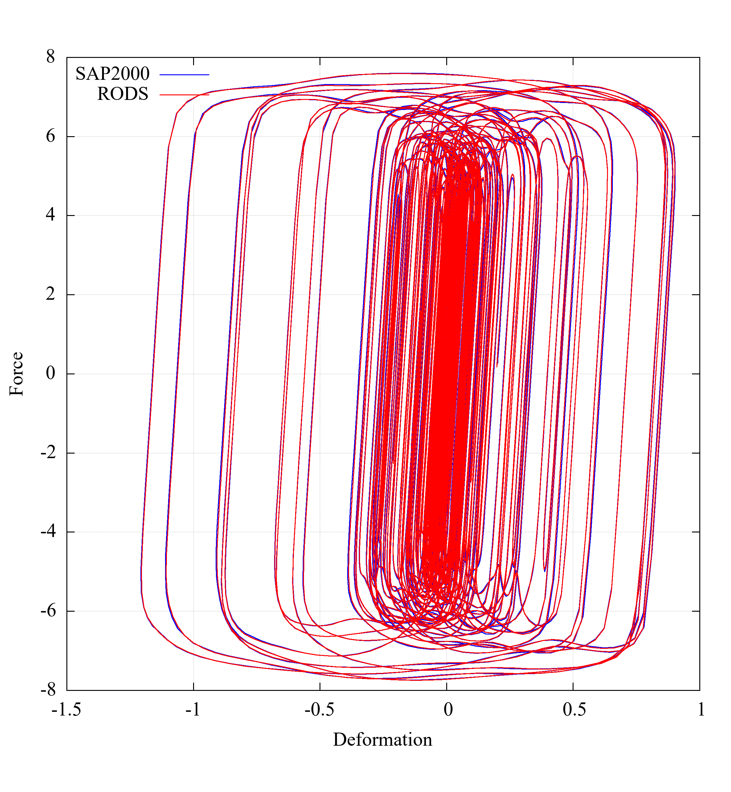
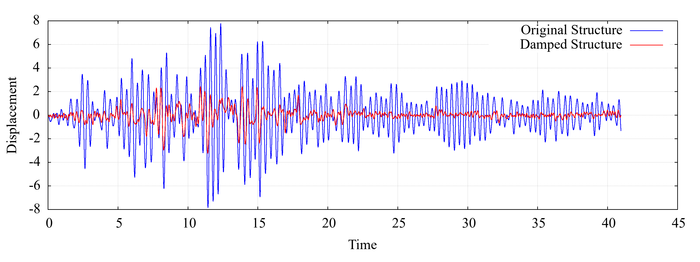

# RODS算例验证
--------------

## 桁架

### 模型





### RODS代码

```c++
#include "dsystem.h"

void example_truss()
{
	dsystem *ds = new dsystem();

	double mass = 0.01;
	double E = 206.0;
	double A = 2148.84937505542;
	double EA = E*A;

	int nnd = 7;
	int ne = 11;

	double nodeCoord[7][2] {	
                                {-4500 , 0},
                                {-1500 , 0},
                                {1500  , 0},
                                {4500  , 0},
                                {-3000 , 3000},
                                {0     , 3000},
                                {3000  , 3000} };

	double x = 0, z = 0;

	for (int i = 0; i < nnd; i++)
	{
		ds->addDof(2*i+1, X, mass);
		ds->addDof(2*i+2, Z, mass);

		x = nodeCoord[i][0];
		z = nodeCoord[i][1];
		ds->addNode(i+1, x, z, 2*i+1, 2*i+2, -1);
	}

	ds->fixNode(1);
	ds->fixNode(4);

	int elementConnect[11][2] { 
                        {1, 2},
                        {2, 3},
                        {3, 4},
                        {5, 6},
                        {6, 7},
                        {1, 5},
                        {2, 6},
                        {3, 7},
                        {2, 5},
                        {3, 6},
                        {4, 7} };

	int ni = 0, nj = 0;
	for (int i = 0; i < ne; i++)
	{
		ni = elementConnect[i][0];
		nj = elementConnect[i][1];
		ds->addTrussElastic(i + 1, ni, nj, EA);
	}

	ds->assembleMatrix();
	ds->solveEigen();

	char gmshFile[] = "truss.msh";
	ds->exportGmsh(gmshFile);

	ds->printInfo();
}

```

### 自振周期

|阶次|SAP2000|RODS|误差|
|----|----|----|----|
| 1  |0.141031|0.141031|0.00000%|
| 2  |0.100579|0.100579|0.00000%|
| 3  |0.067013|0.0670129|-0.00015%|
| 4  |0.046582|0.0465817|-0.00064%|
| 5  |0.044161|0.0441615|0.00113%|
| 6  |0.044097|0.0440968|-0.00045%|
| 7  |0.035354|0.0353539|-0.00028%|
| 8  |0.031442|0.031442|0.00000%|
| 9  |0.027418|0.0274185|0.00182%|
|10  |0.027404|0.0274039|-0.00036%|

### 振型




## 三层框架

### 模型



### 自振周期

|阶次|SAP2000|RODS|误差|
|----|----|----|----|
| 1  |0.368639|0.368279|-0.098%|
| 2  |0.101599|0.101575|-0.024%|
| 3  |0.050439|0.0504651|0.052%|
| 4  |0.023979|0.0239786|-0.002%|
| 5  |0.023926|0.0239247|-0.005%|
| 6  |0.023803|0.023857|0.227%|
| 7  |0.021319|0.0213192|0.001%|
| 8  |0.020974|0.0209765|0.012%|
| 9  |0.019725|0.0197245|-0.003%|
|10  |0.012318|0.0123179|-0.001%|
|11  |0.012252|0.012252|0.000%|
|12  |0.011988|0.0119879|-0.001%|

### 振型





### 地震响应

#### 黏滞阻尼器减震结构

原结构顶点位移相应


减震结构顶点位移相应


阻尼器滞回曲线


减震效果（RODS）


#### 金属阻尼器减震结构

