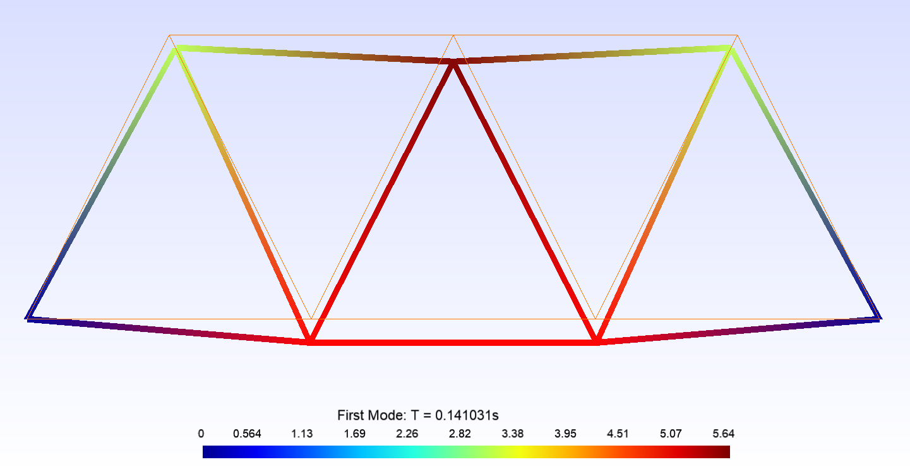
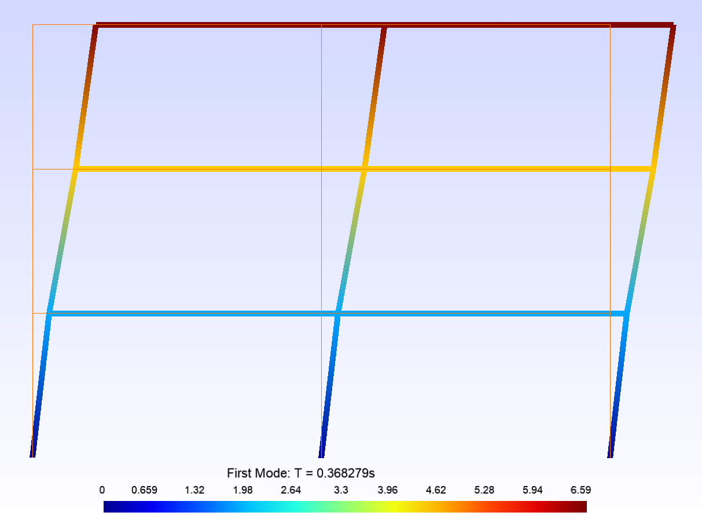
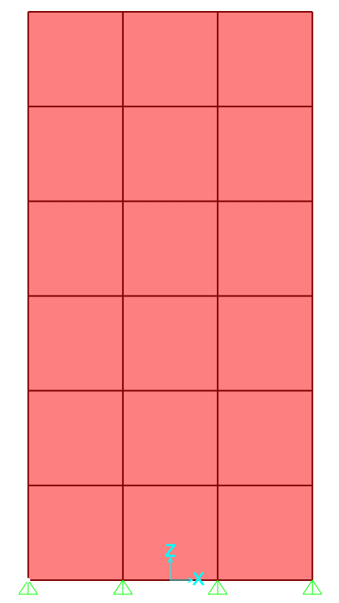
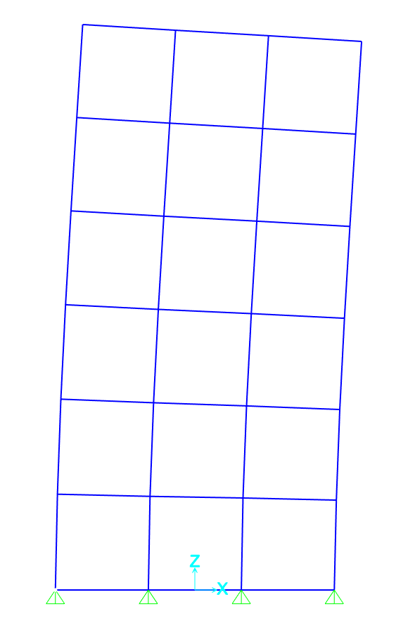
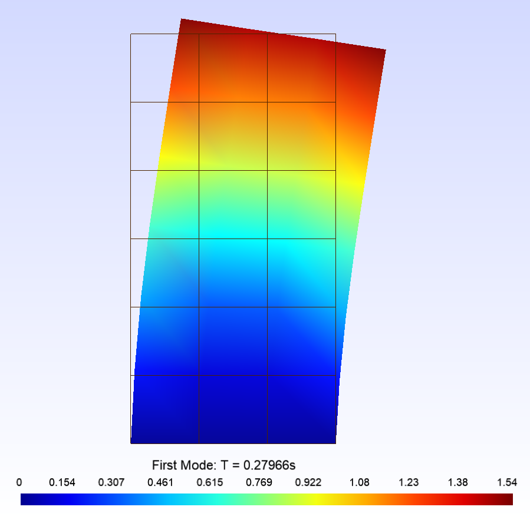
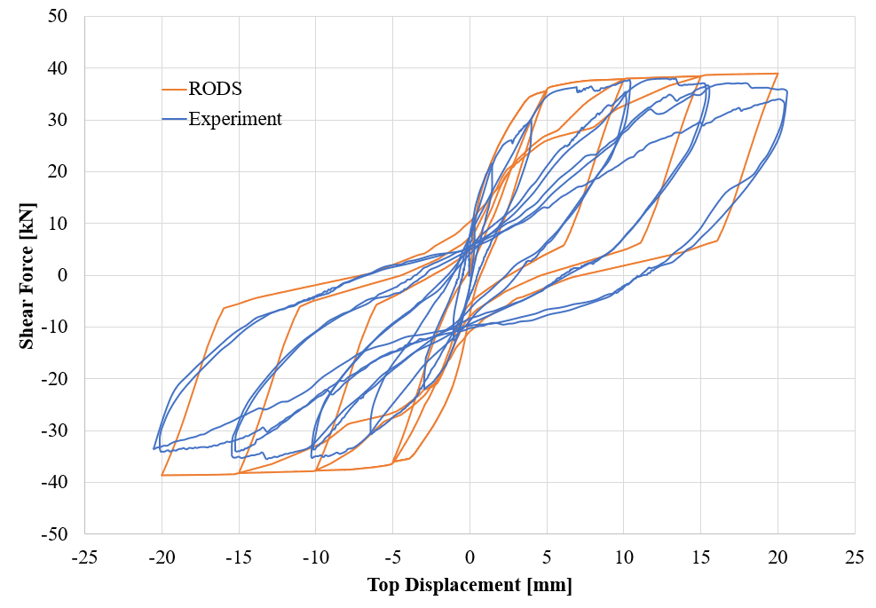
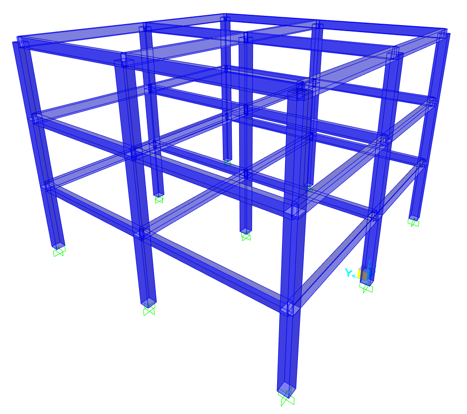
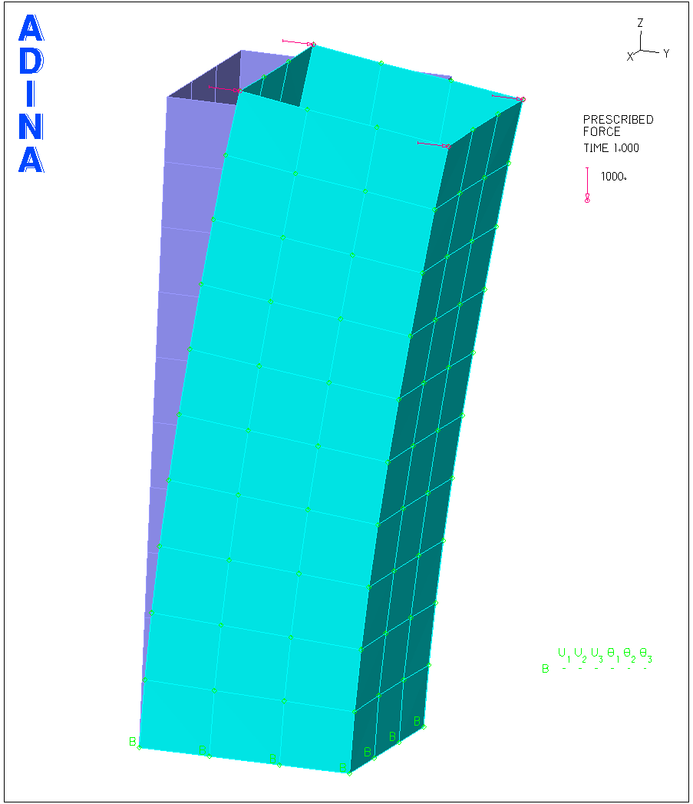
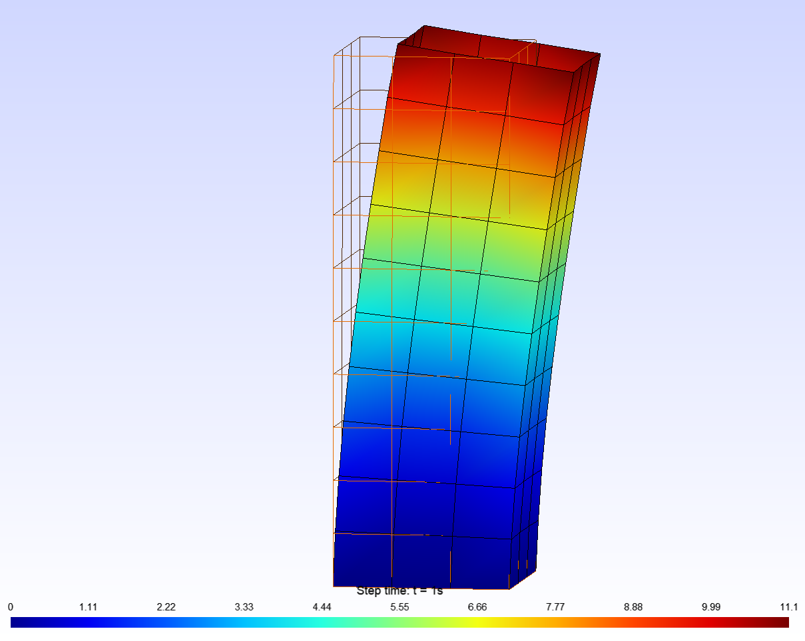

# RODS算例验证

## 二维桁架

### 模型

### 自振周期

|阶次|SAP2000|RODS|误差|
|----|----|----|----|
| 1  |0.141031|0.141031|0.00000%|
| 2  |0.100579|0.100579|0.00000%|
| 3  |0.067013|0.0670129|-0.00015%|
| 4  |0.046582|0.0465817|-0.00064%|
| 5  |0.044161|0.0441615|0.00113%|
| 6  |0.044097|0.0440968|-0.00045%|
| 7  |0.035354|0.0353539|-0.00028%|
| 8  |0.031442|0.031442|0.00000%|
| 9  |0.027418|0.0274185|0.00182%|
|10  |0.027404|0.0274039|-0.00036%|

### 振型

## 二维框架

### 模型

### 自振周期

|阶次|SAP2000|RODS|误差|
|----|----|----|----|
| 1  |0.368639|0.368639|0.000%|
| 2  |0.101599|0.101599|0.000%|
| 3  |0.050439|0.050439|0.000%|
| 4  |0.023979|0.023979|0.000%|
| 5  |0.023926|0.023926|0.000%|
| 6  |0.023803|0.023803|0.000%|
| 7  |0.021319|0.021319|0.000%|
| 8  |0.020974|0.020974|0.000%|
| 9  |0.019725|0.019725|0.000%|
|10  |0.012318|0.012318|0.000%|
|11  |0.012252|0.012252|0.000%|
|12  |0.011988|0.011988|0.000%|

### 振型

### 地震响应

#### 黏滞阻尼器减震结构

原结构顶点位移响应

减震结构顶点位移响应

阻尼器滞回曲线

减震效果（RODS）

#### 金属阻尼器减震结构

待整理

## 二维剪力墙

### 模型

### 自振周期

|阶次|SAP2000|RODS|误差|
|----|----|----|----|
| 1 |0.279660|0.27966|0.0000%|
| 2 |0.074783|0.074783|0.0000%|
| 3 |0.072494|0.0724938|-0.0003%|
| 4 |0.035555|0.0355554|0.0011%|
| 5 |0.035040|0.0350404|0.0011%|
| 6 |0.027949|0.0279491|0.0004%|
| 7 |0.025509|0.0255089|-0.0004%|
| 8 |0.023839|0.0238392|0.0008%|
| 9 |0.022843|0.0228432|0.0009%|
|10 |0.021479|0.0214786|-0.0019%|
|11 |0.021282|0.0212816|-0.0019%|
|12 |0.020554|0.0205538|-0.0010%|

### 振型

## 二维非线性悬臂柱

### 计算模型

悬臂柱，截面尺寸360×360mm^2，构件长750mm。

采用基于位移的框架单元（2个高斯积分点），材料非线性由纤维截面模拟，考虑P-Delta效应。受弯一端划分出长度为0.5倍截面高度的小单元以体现曲率的突变（类似塑性铰）。混凝土划分为10根（条）纤维，两侧钢筋各为1根（条）纤维。

混凝土材料受压骨架曲线为多段线，不考虑受拉。

钢筋材料骨架曲线为两段线，再加载时指向历史最大加载点。

### 计算数据与试验数据对比

## 三维框架

### 模型

### 自振周期

#### 不考虑刚性隔板

|阶次|SAP2000|RODS|误差|
|----|----|----|----|
| 1  | 0.368639 | 0.368639 | 0.0000% |
| 2  | 0.368639 | 0.368639 | 0.0000% |
| 3  | 0.356746 | 0.356746 | 0.0000% |
| 4  | 0.319868 | 0.319868 | 0.0000% |
| 5  | 0.271690 | 0.271690 | 0.0000% |
| 6  | 0.271690 | 0.271690 | 0.0000% |
| 7  | 0.101599 | 0.101599 | 0.0000% |
| 8  | 0.101599 | 0.101599 | 0.0000% |
| 9  | 0.100212 | 0.100212 | 0.0000% |
| 10 | 0.099780 | 0.099780 | 0.0000% |
| 11 | 0.096520 | 0.096521 | 0.0010% |
| 12 | 0.096520 | 0.096521 | 0.0010% |
| 13 | 0.050439 | 0.050439 | 0.0000% |
| 14 | 0.050439 | 0.050439 | 0.0000% |
| 15 | 0.050249 | 0.050249 | 0.0000% |
| 16 | 0.050208 | 0.050208 | 0.0000% |
| 17 | 0.049773 | 0.049773 | 0.0000% |
| 18 | 0.049773 | 0.049773 | 0.0000% |
| 19 | 0.023979 | 0.023979 | 0.0000% |
| 20 | 0.023926 | 0.023926 | 0.0000% |
| 21 | 0.023926 | 0.023926 | 0.0000% |
| 22 | 0.023874 | 0.023874 | 0.0000% |
| 23 | 0.023803 | 0.023803 | 0.0000% |
| 24 | 0.023803 | 0.023803 | 0.0000% |
| 25 | 0.023752 | 0.023752 | 0.0000% |
| 26 | 0.023752 | 0.023752 | 0.0000% |
| 27 | 0.023630 | 0.023630 | 0.0000% |
| 28 | 0.021319 | 0.021319 | 0.0000% |
| 29 | 0.021319 | 0.021319 | 0.0000% |
| 30 | 0.021313 | 0.021313 | 0.0000% |

#### 考虑刚性隔板

## 三维薄壳

### 模型

| 顶点变形  | ABAQUS |SAP2000 | ADINA | RODS |
|---|---|---|---|---|
| X 方向  | 0.123290  |0.124703   | 0.113079  | 0.113488  |
| Y 方向  | 10.9958  |10.993488  |  10.8818 | 10.8891  |
| Z 方向  | 2.18554  |2.187452  | 2.15309  |  2.15396 |
| RX 方向  | -0.00207923  |-0.001988  | -0.00207689  | -0.00198042  |
| RY 方向  | 0.000172243  |0.000185   |  0.000147438 | 0.000126421  |
| RZ 方向  | -4.93729E-06  |1.652E-06  | 2.24868E-05  |  2.08768E-05 |

