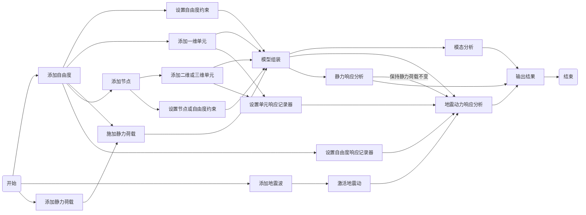

# RODS 命令使用说明

## RODS 分析过程

RODS 以自由度为最小建模单位。建模逻辑为：

自由度->一维单元
自由度->节点->二维、三维单元

一维、二维、三维单元可共存于同一模型。

建模分析过程为：

## 结构体系参数设置

* clear()
  * 功能：删除模型并新建空模型

* set_damping_ratio(zeta)
  * 功能：设置固有阻尼比
  * 参数列表：
    * zeta —— 结构固有阻尼比

* set_rayleigh_damping(omg1, omg2)
  * 功能：设置 Rayleigh 阻尼的两个计算圆频率
  * 参数列表：
    * omg1 —— 圆频率1
    * omg2 —— 圆频率2
  * 特殊说明：
    * 需要先进行模态分析
    * 设置后固有阻尼矩阵按 Rayleigh 阻尼计算

* set_num_modes_inherent_damping(n)
  * 功能：设置阻尼矩阵计算时所考虑的模态数
  * 参数列表：
    * n —— 模态数
  * 特殊说明：
    * 需要先进行模态分析
    * 设置后固有阻尼矩阵按模态阻尼比直接计算

## 建模

* add_dof(id, dir, m)
  * 功能：添加自由度
  * 参数列表：
    * id —— 编号
    * dir —— 方向（见 Direction）
    * m —— 质量

* add_dof_x(id, m)
  * 功能：添加X向自由度
  * 参数列表：
    * id —— 编号
    * m —— 质量

* fix_dof(id)
  * 功能：固定自由度
  * 参数列表：
    * id —— 编号
    * dir —— 方向（见 Direction）
    * m —— 质量

* add_spring(id, dofI, dofJ, k)
  * 功能：添加弹簧
  * 参数列表：
    * id —— 编号
    * dofI —— 自由度I的编号
    * dofJ —— 自由度J的编号
    * k —— 弹簧刚度

* add_dashpot(id, dofI, dofJ, c)
  * 功能：添加线性阻尼器
  * 参数列表：
    * id —— 编号
    * dofI —— 自由度I的编号
    * dofJ —— 自由度J的编号
    * c —— 阻尼系数

* add_inerter(id, dofI, dofJ, m)
  * 功能：添加惯容
  * 参数列表：
    * id —— 编号
    * dofI —— 自由度I的编号
    * dofJ —— 自由度J的编号
    * m —— 惯容系数

* add_spis2(id, dofI, dofJ, dofIN, m, c, k)
  * 功能：添加惯容
  * 参数列表：
    * id —— 编号
    * dofI —— 自由度I的编号
    * dofJ —— 自由度J的编号
    * dofIN —— 自由度IN的编号
    * m —— 惯容系数
    * c —— 阻尼系数
    * k —— 弹簧刚度

* add_spring_bilinear(id, dofI, dofJ, k0, uy, alpha);
  * 功能：添加双线性弹塑性弹簧
  * 参数列表：
    * id —— 编号
    * dofI —— 自由度I的编号
    * dofJ —— 自由度J的编号
    * k0 —— 初始刚度
    * uy —— 屈服变形
    * alpha —— 屈服后刚度比

* add_spring_2d(id, dofI, dofJ, k, U)
  * 功能：添加二维弹簧
  * 参数列表：
    * id —— 编号
    * dofI —— 自由度I的编号
    * dofJ —— 自由度J的编号
    * k —— 弹簧刚度
    * U —— 局部坐标系（见 LocalAxis）

* add_dashpot_2d(id, dofI, dofJ, c, U)
  * 功能：添加二维线性阻尼器
  * 参数列表：
    * id —— 编号
    * dofI —— 自由度I的编号
    * dofJ —— 自由度J的编号
    * c —— 阻尼系数
    * U —— 局部坐标系（见 LocalAxis）

* add_inerter_2d(id, dofI, dofJ, m, U)
  * 功能：添加二维惯容
  * 参数列表：
    * id —— 编号
    * dofI —— 自由度I的编号
    * dofJ —— 自由度J的编号
    * m —— 惯容系数
    * U —— 局部坐标系（见 LocalAxis）

* add_tvmd_2d(id, dofI, dofJ, m, c, k, U)
  * 功能：添加二维惯容系统
  * 参数列表：
    * id —— 编号
    * dofI —— 自由度I的编号
    * dofJ —— 自由度J的编号
    * m —— 惯容系数
    * c —— 阻尼系数
    * k —— 弹簧刚度
    * U —— 局部坐标系（见 LocalAxis）

* add_spring_bilinear_2d(id, dofI, dofJ, k0, uy, alpha, U);
  * 功能：添加二维双线性弹塑性弹簧
  * 参数列表：
    * id —— 编号
    * dofI —— 自由度I的编号
    * dofJ —— 自由度J的编号
    * k0 —— 初始刚度
    * uy —— 屈服变形
    * alpha —— 屈服后刚度比
    * U —— 局部坐标系（见 LocalAxis）

* add_spring_3d(id, dofI, dofJ, k, U)
  * 功能：添加三维弹簧
  * 参数列表：
    * id —— 编号
    * dofI —— 自由度I的编号
    * dofJ —— 自由度J的编号
    * k —— 弹簧刚度
    * U —— 局部坐标系（见 LocalAxis）

* add_dashpot_3d(id, dofI, dofJ, c, U)
  * 功能：添加三维线性阻尼器
  * 参数列表：
    * id —— 编号
    * dofI —— 自由度I的编号
    * dofJ —— 自由度J的编号
    * c —— 阻尼系数
    * U —— 局部坐标系（见 LocalAxis）

* add_inerter_3d(id, dofI, dofJ, m, U)
  * 功能：添加三维惯容
  * 参数列表：
    * id —— 编号
    * dofI —— 自由度I的编号
    * dofJ —— 自由度J的编号
    * m —— 惯容系数
    * U —— 局部坐标系（见 LocalAxis）

* add_tvmd_3d(id, dofI, dofJ, m, c, k, U)
  * 功能：添加三维惯容系统
  * 参数列表：
    * id —— 编号
    * dofI —— 自由度I的编号
    * dofJ —— 自由度J的编号
    * m —— 惯容系数
    * c —— 阻尼系数
    * k —— 弹簧刚度
    * U —— 局部坐标系（见 LocalAxis）

* add_spring_bilinear_3d(id, dofI, dofJ, k0, uy, alpha, U);
  * 功能：添加三维双线性弹塑性弹簧
  * 参数列表：
    * id —— 编号
    * dofI —— 自由度I的编号
    * dofJ —— 自由度J的编号
    * k0 —— 初始刚度
    * uy —— 屈服变形
    * alpha —— 屈服后刚度比
    * U —— 局部坐标系（见 LocalAxis）

* add_node_2d(id, x, z, dofX, dofZ, dofRY)
  * 功能：添加二维节点
  * 参数列表：
    * id —— 编号
    * x —— 节点的 X 坐标
    * z —— 节点的 Z 坐标
    * dofX —— X 向自由度编号
    * dofZ —— Z 向自由度编号
    * dofRY —— RY 向自由度编号（设置为-1将不激活该自由度）

* add_node_3d(id, x, y, z, dofX, dofY, dofZ, dofRX, dofRY, dofRZ)
  * 功能：添加三维节点
  * 参数列表：
    * id —— 编号
    * x —— 节点的 X 坐标
    * y —— 节点的 Y 坐标
    * z —— 节点的 Z 坐标
    * dofX —— X 向自由度编号
    * dofY —— Y 向自由度编号
    * dofZ —— Z 向自由度编号
    * dofRX —— RX 向自由度编号（设置为-1将不激活该自由度）
    * dofRY —— RY 向自由度编号（设置为-1将不激活该自由度）
    * dofRZ —— RZ 向自由度编号（设置为-1将不激活该自由度）

* fix_node(id)
  * 功能：固定节点所有的自由度
  * 参数列表：
    * id —— 编号

* fix_node_dof(id, dir)
  * 功能：固定节点某一方向自由度
  * 参数列表：
    * id —— 编号
    * dir —— 方向（见 Direction）

* add_truss_elastic_2d(id, nodeI, nodeJ, EA)
  * 功能：添加二维弹性桁架
  * 参数列表：
    * id —— 编号
    * nodeI —— 节点的 I 编号
    * nodeJ —— 节点的 J 编号
    * EA —— 截面轴向刚度

* add_frame_elastic_2d(id, nodeI, nodeJ, EA, EI)
  * 功能：添加二维弹性框架
  * 参数列表：
    * id —— 编号
    * nodeI —— 节点的 I 编号
    * nodeJ —— 节点的 J 编号
    * EA —— 截面轴向刚度
    * EI —— 截面抗弯刚度

* add_quad4_elastic(id, nodeI, nodeJ, nodeP, nodeQ, E, nu, t)
  * 功能：添加二维弹性四边形平面应力单元
  * 参数列表：
    * id —— 编号
    * nodeI —— 节点的 I 编号
    * nodeJ —— 节点的 J 编号
    * nodeP —— 节点的 P 编号
    * nodeQ —— 节点的 Q 编号
    * E —— 弹性模量
    * nu —— 泊松比
    * t —— 厚度

* add_truss_elastic_3d(id, nodeI, nodeJ, EA)
  * 功能：添加三维弹性桁架
  * 参数列表：
    * id —— 编号
    * nodeI —— 节点的 I 编号
    * nodeJ —— 节点的 J 编号
    * EA —— 截面轴向刚度

* add_frame_elastic_3d(id, nodeI, nodeJ, EA, EIy, EIz, GIp)
  * 功能：添加三维弹性框架
  * 参数列表：
    * id —— 编号
    * nodeI —— 节点的 I 编号
    * nodeJ —— 节点的 J 编号
    * EA —— 截面轴向刚度
    * EIy —— 截面抗弯刚度（绕局部y轴）
    * EIz —— 截面抗弯刚度（绕局部z轴）
    * GIp —— 截面扭转刚度

* add_rect_shell4_elastic(id, nodeI, nodeJ, nodeP, nodeQ, E, nu, t)
  * 功能：添加三维弹性矩形薄壳
  * 参数列表：
    * id —— 编号
    * nodeI —— 节点的 I 编号
    * nodeJ —— 节点的 J 编号
    * nodeP —— 节点的 P 编号
    * nodeQ —— 节点的 Q 编号
    * E —— 弹性模量
    * nu —— 泊松比
    * t —— 厚度

## 记录
* add_dof_recorder(id, rType, fileName)
  * 功能：添加自由度响应记录器
  * 参数列表：
    * id —— 编号
    * rType —— 响应类型（见 Response）
    * fileName —— 记录文件名（bytes类型）

* add_dof_to_recorder(dofId, rId)
  * 功能：向自由度响应记录器中添加自由度
  * 参数列表：
    * dofId —— 自由度编号
    * rId —— 记录器编号

* add_ele_recorder(id, rType, fileName)
  * 功能：添加单元响应记录器
  * 参数列表：
    * id —— 编号
    * rType —— 响应类型（见 Response）
    * fileName —— 记录文件名（bytes类型）

* add_ele_to_recorder(eleId, rId)
  * 功能：向单元响应记录器中添加单元
  * 参数列表：
    * eleId —— 自由度编号
    * rId —— 记录器编号

* export_gmsh(fileName)
  * 功能：将模型导出为 gmsh 格式
  * 参数列表：
    * fileName —— 记录文件名（文件名后缀为msh；bytes类型）

* export_modal_gmsh(fileName, order)
  * 功能：将模态形状导出为 gmsh 格式
  * 参数列表：
    * fileName —— 记录文件名（文件名后缀为msh；bytes类型）
    * order —— 模态阶次

* set_response_gmsh(fileName, interval)
  * 功能：将结构响应（目前只支持位移）导出为 gmsh 格式
  * 参数列表：
    * fileName —— 记录文件名（文件名后缀为msh；bytes类型）
    * interval —— 记录间隔（即每隔几个分析步记录一次；设置为0或负数时不导出gmsh文件）

## 求解

* assemble_matrix()
  * 功能：组装矩阵并应用边界条件

* solve_eigen()
  * 功能：求解特征值（模态）

* set_dynamic_solver(s)
  * 功能：设置运动方程求解器
  * 参数列表：
    * s —— 运动方程求解器（见 DynamicSolver）

* solve_seismic_response(nsub)
  * 功能：求解地震响应
  * 参数列表：
    * nsub —— 每个地震激励步内划分的子步数

## RODS 定义的枚举类型

* Direction
  * X = 0
  * Y = 1
  * Z = 2
  * RX = 3
  * RY = 4
  * RZ = 5

* Response
  * DISP = 0
  * VEL = 1
  * ACC = 2
  * FORCE = 3
  * DEF = 4
  * ALL = 5

* DynamicSolver
  * Newmark = 0
  * Newmark_NL = 1
  * StateSpace = 2
  * StateSpace_NL = 3

* LocalAxis
  * U1 = 0
  * U2 = 1
  * U3 = 2